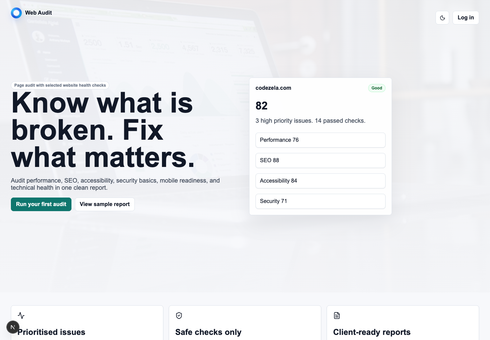
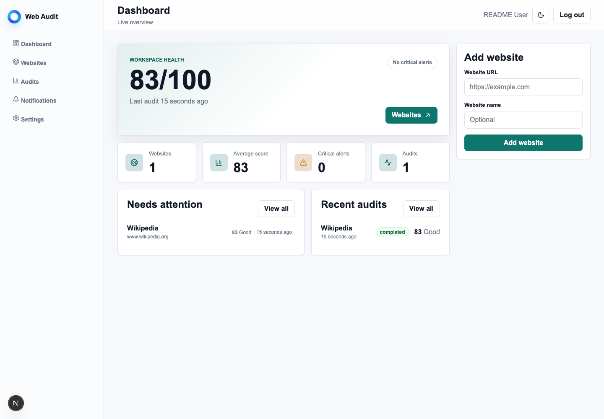
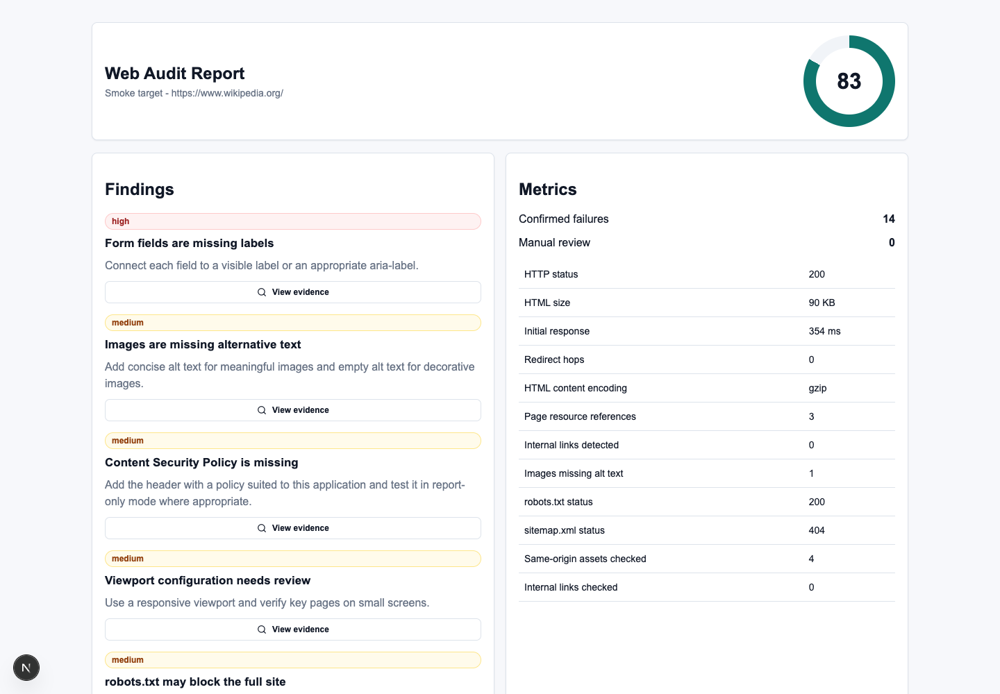
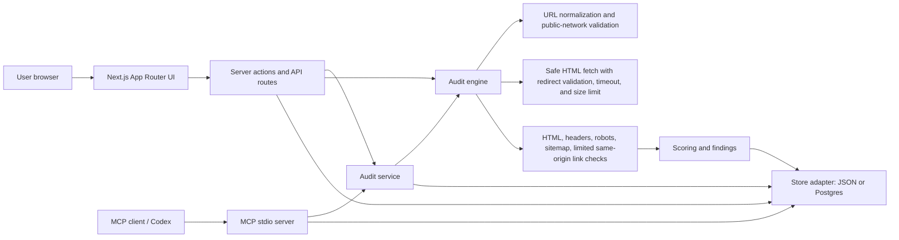
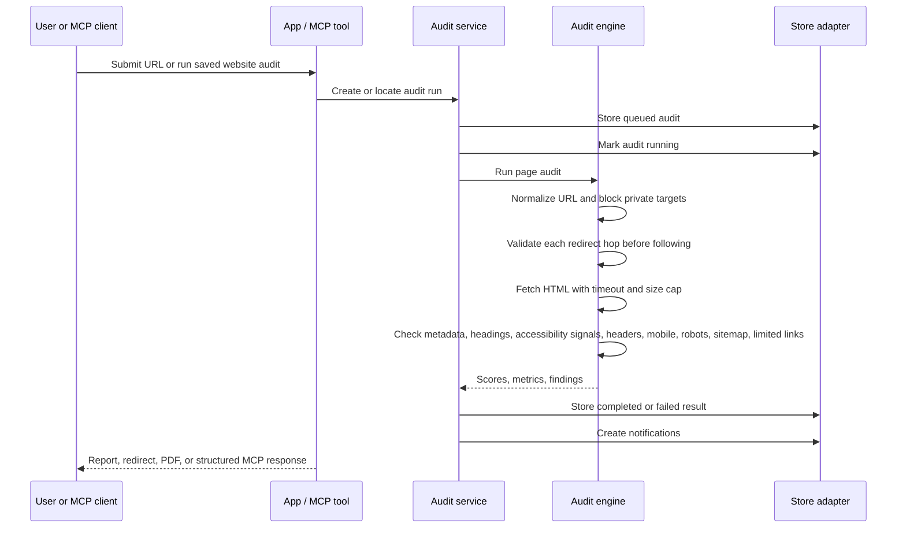
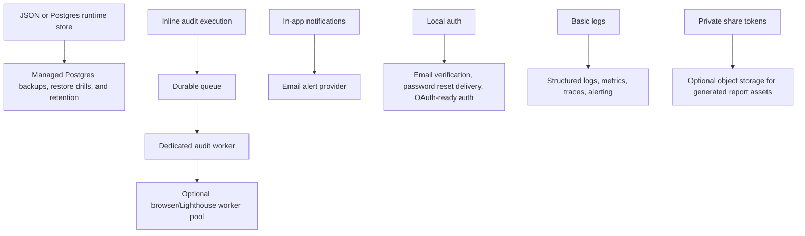

# Web Audit

Web Audit is a production-minded website audit and monitoring product with a local MCP stdio server for agent workflows. It audits one submitted page, adds selected website health checks, stores reports in JSON or Postgres, and presents findings in a calm report-first UI.

The v1 product boundary is intentional: this is a page audit with selected website health checks. It is not a full-site crawler, penetration testing tool, keyword rank tracker, or deep vulnerability scanner.







## Contents

- [Product Scope](#product-scope)
- [Features](#features)
- [Architecture](#architecture)
- [Audit Model](#audit-model)
- [Security Model](#security-model)
- [MCP Server](#mcp-server)
- [Agent Connections](#agent-connections)
- [Setup](#setup)
- [Environment Variables](#environment-variables)
- [Commands](#commands)
- [Application Routes](#application-routes)
- [Data Storage](#data-storage)
- [Metrics](#metrics)
- [Production Posture](#production-posture)
- [Production Deployment Checklist](#production-deployment-checklist)
- [Verification](#verification)
- [Limitations](#limitations)
- [Future Production Migrations](#future-production-migrations)
- [Further Documentation](#further-documentation)
- [Agent Notes](#agent-notes)

## Product Scope

Web Audit helps a user:

- Add a website URL.
- Run a safe non-invasive audit of the submitted page.
- View performance, SEO, accessibility, security basics, technical health, and mobile readiness findings.
- Understand severity, evidence, impact, and recommended fixes.
- Export a completed report as PDF.
- Create and revoke private report share links.
- Configure simple scheduled audits.
- Receive in-app notifications for completed audits, failed audits, critical issues, and score drops.
- Use the same audit engine from an MCP-compatible agent.

The product promise is:

> Know what is broken. Fix what matters.

## Features

Implemented product surfaces:

- Next.js App Router UI for landing, signup, login, dashboard, websites, audits, notifications, settings, admin health, sample report, legal pages, and share links.
- Email/password authentication with scrypt password hashing and HTTP-only session cookies.
- Password reset token flow, profile editing, password changes, account deletion, and notification preferences.
- Website management with normalized URLs, favicon lookup, per-user website ownership, and duplicate protection.
- Audit execution with `queued`, `running`, `completed`, and `failed` states plus a local worker command for queued jobs.
- Report pages with category scores, findings, metrics, evidence modals, referenced URLs, image previews, and recommendations.
- PDF report generation with `@react-pdf/renderer`, a sparse client-ready layout, and in-browser export feedback.
- Evidence image previews through a same-origin, SSRF-protected preview proxy with size, timeout, redirect, and content-type limits.
- Private share links for completed audits with copy/open/revoke modal UX.
- Light and dark mode with a persistent theme switch.
- Paginated audit history and notification filters for unread and critical alerts.
- Production SEO assets through Next.js App Router metadata conventions: SVG app icon, generated Apple icon, web app manifest, generated Open Graph image, generated Twitter image, sitemap, robots, canonical metadata, and homepage JSON-LD.
- Polished loading, not-found, and error states.
- Scheduled audit endpoint protected by `CRON_SECRET` in production and rate limited.
- Local JSON persistence for self-hosted/single-node operation.
- Postgres/Drizzle runtime persistence with SQL migrations, shared rate limits, and a smoke test for auth, website, audit, findings, metrics, notifications, scheduling, and share links.
- MCP stdio server exposing validation, audit, persistence, and report retrieval tools.

## Architecture



Key modules:

- `src/app/*` contains the application routes and API routes.
- `src/app/icon.svg`, `src/app/apple-icon.tsx`, `src/app/opengraph-image.tsx`, `src/app/twitter-image.tsx`, and `src/app/manifest.ts` provide metadata assets through Next.js file conventions.
- `src/lib/audit-engine.ts` runs the page audit and produces metrics/findings.
- `src/lib/audit-service.ts` manages website records, audit runs, schedules, share links, and notifications.
- `src/lib/url.ts` normalizes URLs and blocks local/private/internal network targets before audit work starts.
- `src/lib/persistence/*` contains the JSON and Postgres store adapters.
- `src/lib/store.ts` keeps JSON file helpers and shared ID/time helpers.
- `src/db/schema.ts` and `migrations/*.sql` define the Postgres runtime schema.
- `src/mcp/server.ts` exposes the local MCP stdio tools.
- `scripts/worker-once.ts` processes queued audit runs from the same service layer.

## Audit Model



Audit categories:

- Performance: initial HTML response time, HTML size, compression, resource reference count.
- SEO: title, meta description quality, H1 structure, canonical quality, Open Graph/Twitter metadata, structured data presence and parse validity, robots.txt content basics, sitemap.xml content basics, noindex signals.
- Accessibility: missing image alt text, missing form labels, unnamed interactive elements, heading order, document language, main landmark, duplicate IDs, ARIA reference integrity, and a clear note that automated coverage is limited.
- Security basics: HTTPS final URL check, common browser security headers, header quality, mixed-content signals, unsafe referrer policy, permissive CSP signals.
- Technical health: HTTP status, redirect chain metrics, HTML structure signals, link hygiene, limited same-origin internal link checks, and limited same-origin asset checks with GET fallback verification.
- Mobile readiness: viewport metadata and zoom-restriction signals.

The audit engine checks the submitted page as the primary target and checks a small limited number of same-origin links for basic status health. It does not crawl an entire site.
Findings can be `failed`, `needs_review`, `passed`, or `skipped`. Scores only penalize confirmed `failed` findings; platform-managed or conditional resources can be shown as `needs_review` so the report stays useful without overstating automation limits.

## Security Model

Security controls that must remain active in every audit path, including MCP tools:

- Only HTTP and HTTPS URLs are allowed.
- URL input is trimmed, normalized, and capped at 2048 characters.
- Username, password, and URL hash fragments are stripped.
- Localhost and direct loopback hosts are blocked.
- DNS is resolved before audit execution.
- Private, loopback, link-local, and internal IPv4/IPv6 ranges are blocked.
- Redirects are followed manually with a strict limit, and every redirect target is revalidated before fetch.
- Public unauthenticated audit API calls are rate limited by forwarded IP.
- Per-user website creation and audit execution are rate limited.
- Audit fetches use a fixed user agent, a 15 second timeout, HTML-only content validation, and a 2 MB HTML size limit.
- Scheduled audit execution requires `CRON_SECRET` outside development and is rate limited.
- `/admin` and `/api/admin/health` require an `ADMIN_EMAILS` allowlist outside development.
- `/api/health` is public liveness only and does not expose account or audit counts.
- Sessions use HTTP-only cookies and secure cookies in production.
- Passwords are hashed with Node `scrypt`.
- The local JSON store serializes in-process writes to avoid lost updates in single-process operation.

Important production note: if the worker layer is replaced, keep URL validation and private-network blocking inside the worker too. Do not rely only on web-route validation.

## MCP Server

The MCP server uses stdio transport and runs locally:

```bash
npm run mcp
```

Available tools:

| Tool | Purpose | Persists data |
| --- | --- | --- |
| `validate_audit_url` | Normalize a URL and confirm it is safe to audit. | No |
| `run_page_audit` | Run a safe non-invasive page audit and return scores, metrics, and findings. | No |
| `save_website_and_audit` | Create or reuse the MCP agent user, save a website, run an audit, and store the report for the web UI. | Yes |
| `get_audit_report` | Fetch a persisted audit report with website, audit, findings, and metrics by audit ID. | No additional writes |

Example MCP client configuration:

```json
{
  "mcpServers": {
    "web-audit": {
      "command": "npm",
      "args": ["run", "mcp"],
      "cwd": "/Users/sayuru/Documents/GitHub/web-audit-mcp"
    }
  }
}
```

Example tool workflow:

1. Call `validate_audit_url` with `https://example.com`.
2. Call `run_page_audit` for an immediate one-off report.
3. Call `save_website_and_audit` when the report should appear in the web UI and local store.
4. Call `get_audit_report` later with the persisted audit ID.

MCP persistence uses the same active store adapter as the web app. `save_website_and_audit` creates an internal `agent@webaudit.local` user if it does not already exist.

## Agent Connections

For Codex, Claude, Claude Desktop, and generic MCP clients, see [docs/agent-connections.md](docs/agent-connections.md).

Short version:

```bash
npm run mcp
codex mcp add web-audit -- npm run mcp
claude mcp add --transport stdio --scope local web-audit -- npm run mcp
npm run mcp:smoke -- https://example.com --run-audit
```

Codex and Claude can use this product today through the local stdio MCP server. ChatGPT custom connectors and OpenAI API MCP integrations need a remote HTTP MCP server; that is a future transport, not the current local stdio server.

## Setup

Prerequisites:

- Node.js compatible with Next.js 16 and the package versions in `package.json`.
- npm.
- Network access from the runtime to the public pages you audit.

Install dependencies:

```bash
npm install
```

Create local environment values:

```bash
cp .env.example .env.local
```

Start the app:

```bash
npm run dev
```

Open:

```text
http://localhost:3000
```

Run a direct CLI audit:

```bash
npm run audit:url -- https://example.com
```

Process queued audits once:

```bash
npm run worker:once -- 5
```

Run the MCP server:

```bash
npm run mcp
```

## Environment Variables

| Variable | Required | Default/example | Used by | Notes |
| --- | --- | --- | --- | --- |
| `NEXT_PUBLIC_APP_URL` | Recommended | `http://localhost:3000` | App links and deployment configuration | Set to the canonical origin for the environment. Do not leave a localhost value in preview/production. |
| `CRON_SECRET` | Required outside development | `replace-for-production` | `POST /api/cron/run-scheduled` | Callers must send `Authorization: Bearer <CRON_SECRET>` when configured. Use a strong random value. |
| `ADMIN_EMAILS` | Required outside development for admin access | `admin@example.com` | `/admin`, `/api/admin/health` | Comma-separated email allowlist. |
| `WEB_AUDIT_DEV_RESET_TOKENS` | No | `false` | Forgot-password flow | Development-only reset-token display. Production blocks this even if it is accidentally set to `true`. |
| `WEB_AUDIT_STORE` | No | `json` | Store adapter | Use `json` for `data/webaudit.json` or `postgres` for Postgres runtime persistence. |
| `DATABASE_URL` | Required for Postgres mode | `postgresql://localhost:5432/web_audit_mcp` | Postgres adapter and migrations | Required when `WEB_AUDIT_STORE=postgres`. Keep unset in JSON mode. |

This repo does not require queue, object storage, email, analytics, or payment provider environment variables. Add those only when the matching infrastructure is actually implemented.

## Commands

| Command | Purpose |
| --- | --- |
| `npm run dev` | Start the Next.js development server. |
| `npm run build` | Build the production Next.js app. |
| `npm run start` | Start the built Next.js app. |
| `npm run lint` | Run ESLint. |
| `npm run typecheck` | Run TypeScript with `--noEmit`. |
| `npm run test` | Run Vitest tests. |
| `npm run check` | Run lint, typecheck, tests, and build. This is the repo health gate. |
| `npm run mcp` | Start the MCP stdio server. |
| `npm run mcp:smoke -- https://example.com --run-audit` | Start the MCP server through an SDK client, verify tool registration, validate a URL, and optionally run an audit. |
| `npm run audit:url -- https://example.com` | Run a one-off CLI page audit and print JSON. |
| `npm run worker:once -- 5` | Process up to five queued audit runs. |
| `npm run db:migrate` | Apply Postgres migrations when `DATABASE_URL` is configured. |
| `npm run db:smoke -- https://www.wikipedia.org/` | Run a Postgres-backed service smoke test. Add `--keep` to retain the sample audit. |
| `npm run db:schema:check` | Verify the committed Drizzle schema table set. |

## Application Routes

Primary UI routes:

- `/` landing page.
- `/icon.svg`, `/apple-icon`, `/manifest.webmanifest`, `/opengraph-image`, and `/twitter-image`.
- `/signup` and `/login`.
- `/forgot-password` and `/reset-password`.
- `/dashboard`.
- `/websites` and `/websites/[id]`.
- `/audits` and `/audits/[id]`.
- `/notifications`.
- `/settings`.
- `/admin`.
- `/sample-report`.
- `/share/[token]`.
- `/privacy` and `/terms`.
- `/robots.txt` and `/sitemap.xml`.

API routes:

- `POST /api/audit-url` runs a public rate-limited one-off page audit.
- `GET /api/admin/health` returns private operational counts for admins only.
- `GET /api/audits/[id]/pdf` exports a completed user-owned audit as PDF.
- `GET /api/image-preview?url=...` renders evidence thumbnails through the same-origin preview proxy.
- `POST /api/cron/run-scheduled` runs due scheduled audits and queued jobs, protected by `CRON_SECRET` outside development.
- `GET /api/health` returns public liveness only.

Route notes:

- `/admin` and `/api/admin/health` require a signed-in user whose email is present in `ADMIN_EMAILS` outside development.
- Authenticated app routes, auth utility pages, and private shared reports publish `noindex` metadata.
- Public marketing/legal pages publish canonical metadata and share metadata.
- `/api/health` intentionally returns only `{ ok: true, service: "web-audit" }`; use it for liveness, not private operational status.
- `/share/[token]` is a private unlisted report link, not public report indexing. Create, copy, open, and revoke share links from the owned audit page.
- `/robots.txt` and `/sitemap.xml` are generated by `src/app/robots.ts` and `src/app/sitemap.ts`.

## Data Storage

Web Audit has two runtime storage modes:

| Mode | Enablement | Best for |
| --- | --- | --- |
| JSON | Default, or `WEB_AUDIT_STORE=json` | Local development, demos, and controlled single-node self-hosting. |
| Postgres | `WEB_AUDIT_STORE=postgres` plus `DATABASE_URL` | Shared runtime persistence, hosted database backups, and multi-instance app deployments. |

Both stores contain:

- Users and hashed passwords.
- Session token hashes.
- Websites.
- Audit runs.
- Findings.
- Metrics.
- Notifications.
- Share links.
- Password reset token hashes.
- Rate limit counters.

JSON stores runtime data in:

```text
data/webaudit.json
```

This local JSON store is useful for development, demos, and single-node self-hosted operation. It is not a multi-instance production database and should not be shared by multiple concurrent application instances.

Local JSON limits:

- Writes are serialized only inside the current Node.js process.
- Multiple app instances, serverless instances, or worker processes can race when writing the same file.
- Rate limits are local to the JSON store and are not a distributed abuse-control mechanism.
- Backups are file-level only unless you add a database export process.
- Treat the JSON file as operational state containing private account and audit data.

Postgres runtime path:

- `postgres` and `drizzle-orm` power the runtime adapter.
- `src/db/schema.ts` defines users, sessions, websites, audits, findings, metrics, notifications, share links, password reset tokens, and rate limits.
- `migrations/0001_initial.sql`, `0002_add_needs_review_finding_status.sql`, and `0003_add_rate_limits.sql` are applied by `npm run db:migrate`.
- `src/lib/persistence/postgres-store.ts` implements the active service adapter used by auth, routes, cron, admin, and MCP.
- `npm run db:smoke -- https://www.wikipedia.org/` verifies a Postgres-backed create-user, add-website, real audit, findings/metrics persistence, notification, schedule, and share-link flow.

Local Postgres example:

```bash
createdb web_audit_mcp
WEB_AUDIT_STORE=postgres DATABASE_URL=postgresql://localhost:5432/web_audit_mcp npm run db:migrate
WEB_AUDIT_STORE=postgres DATABASE_URL=postgresql://localhost:5432/web_audit_mcp npm run db:smoke -- https://www.wikipedia.org/
WEB_AUDIT_STORE=postgres DATABASE_URL=postgresql://localhost:5432/web_audit_mcp npm run dev
```

## Metrics

Every completed audit stores category scores, findings, and metrics. The current metric keys are:

| Key | Category | Unit | Meaning |
| --- | --- | --- | --- |
| `http_status` | Technical | none | Final audited page HTTP status. |
| `html_size` | Technical | KB | Initial HTML response size. |
| `response_time` | Performance | ms | Initial HTML response time. |
| `redirect_hops` | Technical | count | Validated redirect hops. |
| `content_encoding` | Performance | none | HTML content encoding or `none`. |
| `resource_count` | Performance | count | Initial HTML resource references. |
| `internal_links_seen` | SEO | count | Same-origin internal links detected. |
| `images_missing_alt` | Accessibility | count | Images missing `alt`. |
| `robots_status` | SEO | none | `/robots.txt` fetch status. |
| `sitemap_status` | SEO | none | `/sitemap.xml` fetch status. |
| `checked_assets` | Technical | count | Limited same-origin assets checked. |
| `assets_needing_manual_review` | Technical | count | Provider-managed or conditional asset checks that need browser/manual verification. |
| `checked_internal_links` | Technical | count | Limited internal links checked. |

See [docs/audit-metrics.md](docs/audit-metrics.md) for the full score and metric contract.

## Production Posture

Single-node deployment can run the web app and MCP server from the same checkout, using JSON or Postgres. For either mode:

- Set `NEXT_PUBLIC_APP_URL` to the real deployed origin.
- Set a strong `CRON_SECRET`.
- Configure `WEB_AUDIT_STORE`.
- For JSON, ensure the process can read/write `data/webaudit.json`, back up `data/`, and run only one writer process.
- For Postgres, set `DATABASE_URL`, run `npm run db:migrate`, use managed backups, and verify restore into staging.
- Use `npm run worker:once -- 5` or `POST /api/cron/run-scheduled` from a scheduler to process queued/scheduled audits.
- Keep outbound network egress restricted to public HTTP/HTTPS targets where possible.
- Monitor failures from `/api/health`, application logs, and scheduled audit responses.

For serverless or multi-instance deployment, do not rely on `data/webaudit.json`. Use Postgres for shared runtime persistence and keep job execution coordinated so scheduled/queued audits are not double-run.

Production security controls that must stay enabled:

- SSRF blocking in every audit path, including MCP tools and future worker code.
- Public DNS resolution before audit execution and private/internal IP blocking.
- Redirect-hop validation before each follow.
- HTTP/HTTPS-only audits with credentials and URL fragments stripped.
- Fetch timeout, HTML content-type check, and 2 MB HTML cap.
- Evidence image-preview timeout, image content-type check, 2 MB cap, and redirect/private-network validation.
- Public audit, user audit, website creation, and cron rate limits.
- Admin allowlisting via `ADMIN_EMAILS`.
- Cron authorization via `CRON_SECRET`.
- HTTP-only session cookies with secure cookies in production.
- Serialized writes while JSON storage is in use.
- Shared Postgres rate-limit storage when Postgres mode is enabled.

## Production Deployment Checklist

Before a real production launch:

1. Confirm product scope copy says "page audit with selected website health checks" and does not imply crawling, penetration testing, Lighthouse lab scoring, or vulnerability scanning.
2. Run `npm install` from a clean checkout and keep `package-lock.json` committed.
3. Set `NEXT_PUBLIC_APP_URL` to the exact deployed HTTPS origin.
4. Set a strong random `CRON_SECRET` and configure the scheduler to call `POST /api/cron/run-scheduled` with `Authorization: Bearer <secret>`.
5. Set `ADMIN_EMAILS` to the production operator allowlist and verify `/admin` plus `/api/admin/health` deny non-admin users.
6. Keep `WEB_AUDIT_DEV_RESET_TOKENS=false`.
7. Decide storage mode. For single-node JSON, mount persistent private storage for `data/`, run one writer, and back it up. For Postgres, set `WEB_AUDIT_STORE=postgres`, configure `DATABASE_URL`, run migrations, and verify backups/restores.
8. Decide worker mode. For JSON storage, avoid multiple concurrent writers. For Postgres deployments, coordinate cron/worker execution so due audits are not double-run; for high scale, move queued/scheduled work to a durable queue and keep URL safety validation inside the worker.
9. Add real password-reset email delivery before relying on forgot-password in production.
10. Add structured logs, uptime checks, cron failure alerts, backup monitoring, and restore testing.
11. Restrict outbound egress where possible to public HTTP/HTTPS destinations and block metadata/private networks at the platform/firewall layer too.
12. Run `npm run check`.
13. Verify `/`, `/robots.txt`, `/sitemap.xml`, `/manifest.webmanifest`, `/icon.svg`, `/opengraph-image`, and `/twitter-image` return the expected metadata and content types.
14. Exercise one manual audit, one PDF export, one share-link create/copy/open/revoke flow, one scheduled audit call, one admin health call, and the MCP tools against the deployed environment.

## Verification

Before calling the repo healthy, run:

```bash
npm run check
```

Useful targeted checks during development:

```bash
npm run lint
npm run typecheck
npm run test
npm run build
npm run audit:url -- https://example.com
npm run mcp:smoke -- https://example.com --run-audit
npm run worker:once -- 5
WEB_AUDIT_STORE=postgres DATABASE_URL=postgresql://localhost:5432/web_audit_mcp npm run db:migrate
WEB_AUDIT_STORE=postgres DATABASE_URL=postgresql://localhost:5432/web_audit_mcp npm run db:smoke -- https://www.wikipedia.org/
```

For MCP changes, also connect with an MCP client or MCP Inspector and exercise:

- `validate_audit_url`
- `run_page_audit`
- `save_website_and_audit`
- `get_audit_report`

## Limitations

Current v1 limitations:

- Audits one submitted page, not a full website crawl.
- Limited same-origin link checks only; no crawl graph or sitemap crawl.
- Platform-managed resource checks can be marked `needs_review` when a provider-injected URL needs browser/manual verification instead of being treated as a confirmed broken asset.
- Automated accessibility checks are a first pass and do not replace manual keyboard, screen reader, or usability review.
- Security checks are browser/header basics, not penetration testing or vulnerability scanning.
- Performance checks use HTML response and document signals, not full Lighthouse/browser lab metrics.
- Authentication is local email/password only; no email verification, external reset-email delivery, or OAuth provider is configured.
- Password reset tokens are generated and stored hashed, but a real email provider must be added before production reset delivery.
- Notifications are in-app only; no external email/SMS/push provider is configured.
- Scheduled audits run through an HTTP cron endpoint and local queued-job worker path; no external durable queue exists yet.
- JSON mode is not suitable for horizontally scaled production; use Postgres mode for shared runtime persistence.
- PDF export is server-generated and functional, but not a full white-label report system.

## Future Production Migrations

Recommended migrations before serious high-scale production:



Production migration checklist:

- Use Postgres mode for any multi-instance deployment.
- Keep schema migrations and repeatable smoke/fixture tests current.
- Move audit work to a durable queue/worker so web requests do not own long-running jobs.
- Keep URL validation and private-network blocking inside the worker, not only in the web route.
- Preserve explicit validation around every redirect hop/final URL before fetching expanded targets.
- Add account email verification and password reset delivery.
- Add email alerts only after a real delivery provider is configured.
- Add structured logging, audit failure dashboards, and alerting.
- Add retention, export, and deletion policies for user data.
- Add backups and restore drills for the production database.

## Further Documentation

- [docs/production.md](docs/production.md) covers deployment posture, JSON limits, Postgres runtime setup, security controls, and the exact launch checklist.
- [docs/mcp.md](docs/mcp.md) covers MCP setup, tool behavior, persistence boundaries, and safety expectations.
- [docs/agent-connections.md](docs/agent-connections.md) covers Codex, Claude, Claude Desktop, generic MCP client, and ChatGPT/API connection paths.
- [docs/audit-metrics.md](docs/audit-metrics.md) covers score outputs and stored metric keys.

## Agent Notes

Use this README and the files under `docs/` as the current product source of truth. Keep the UI report-first, calm, professional, and honest about v1 scope. Do not imply full-site crawling or penetration testing. Keep SSRF protections, rate limits, timeouts, and private network blocking active in every audit path, including MCP tools.
