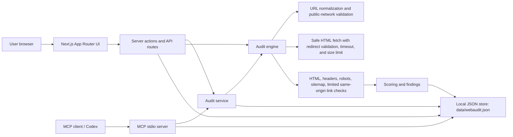
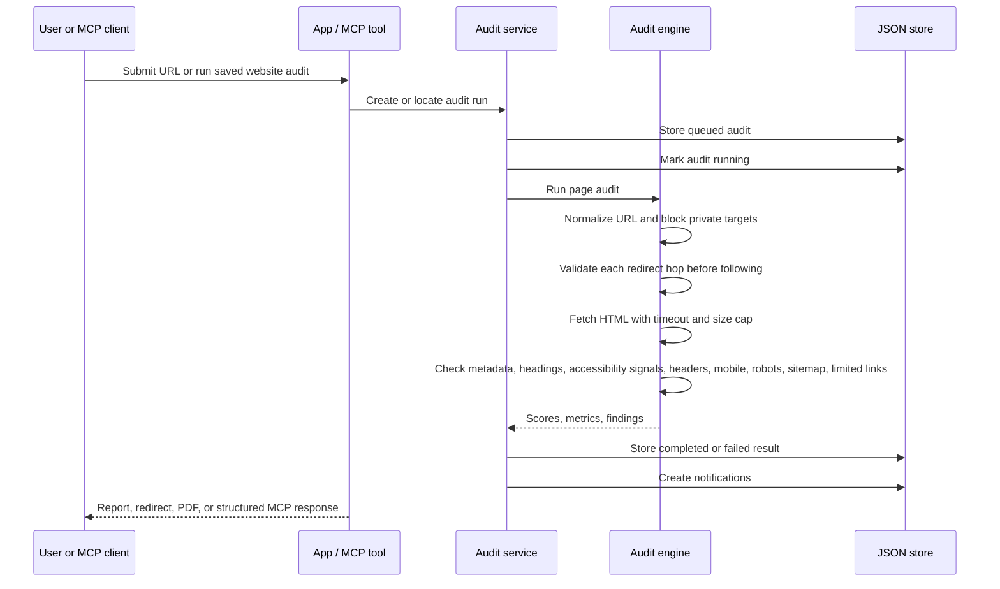
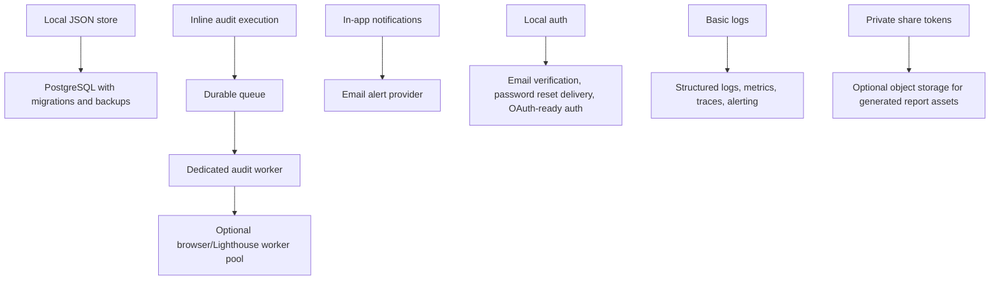

# Web Audit

Web Audit is a production-minded website audit and monitoring product with a local MCP stdio server for agent workflows. It audits one submitted page, adds selected website health checks, stores reports locally, and presents findings in a calm report-first UI.

The v1 product boundary is intentional: this is a page audit with selected website health checks. It is not a full-site crawler, penetration testing tool, keyword rank tracker, or deep vulnerability scanner.

## Contents

- [Product Scope](#product-scope)
- [Features](#features)
- [Architecture](#architecture)
- [Audit Model](#audit-model)
- [Security Model](#security-model)
- [MCP Server](#mcp-server)
- [Setup](#setup)
- [Environment Variables](#environment-variables)
- [Commands](#commands)
- [Application Routes](#application-routes)
- [Data Storage](#data-storage)
- [Deployment Guidance](#deployment-guidance)
- [Verification](#verification)
- [Limitations](#limitations)
- [Future Production Migrations](#future-production-migrations)
- [Agent Notes](#agent-notes)

## Product Scope

Web Audit helps a user:

- Add a website URL.
- Run a safe non-invasive audit of the submitted page.
- View performance, SEO, accessibility, security basics, technical health, and mobile readiness findings.
- Understand severity, evidence, impact, and recommended fixes.
- Export a completed report as PDF.
- Create and revoke private report share links.
- Configure simple scheduled audits.
- Receive in-app notifications for completed audits, failed audits, critical issues, and score drops.
- Use the same audit engine from an MCP-compatible agent.

The product promise is:

> Know what is broken. Fix what matters.

## Features

Implemented product surfaces:

- Next.js App Router UI for landing, signup, login, dashboard, websites, audits, notifications, settings, admin health, sample report, legal pages, and share links.
- Email/password authentication with scrypt password hashing and HTTP-only session cookies.
- Password reset token flow, profile editing, password changes, account deletion, and notification preferences.
- Website management with normalized URLs, favicon lookup, per-user website ownership, and duplicate protection.
- Audit execution with `queued`, `running`, `completed`, and `failed` states plus a local worker command for queued jobs.
- Report pages with category scores, findings, metrics, evidence, and recommendations.
- PDF report generation with `pdfkit`.
- Private share links for completed audits.
- Scheduled audit endpoint protected by `CRON_SECRET` in production and rate limited.
- Local JSON persistence for self-hosted/single-node operation.
- MCP stdio server exposing validation, audit, persistence, and report retrieval tools.

## Architecture



Key modules:

- `src/app/*` contains the application routes and API routes.
- `src/lib/audit-engine.ts` runs the page audit and produces metrics/findings.
- `src/lib/audit-service.ts` manages website records, audit runs, schedules, share links, and notifications.
- `src/lib/url.ts` normalizes URLs and blocks local/private/internal network targets before audit work starts.
- `src/lib/store.ts` persists local runtime data to `data/webaudit.json`.
- `src/mcp/server.ts` exposes the local MCP stdio tools.
- `scripts/worker-once.ts` processes queued audit runs from the same service layer.

## Audit Model



Audit categories:

- Performance: initial HTML response time, HTML size, resource reference count.
- SEO: title, meta description, H1 structure, canonical URL, Open Graph title, structured data, robots.txt, sitemap.xml, noindex.
- Accessibility: missing image alt text, missing form labels, unnamed interactive elements, heading order, and a clear note that automated coverage is limited.
- Security basics: HTTPS final URL check and common browser security headers.
- Technical health: HTTP status and limited same-origin internal link status checks.
- Mobile readiness: viewport metadata.

The audit engine checks the submitted page as the primary target and checks a small limited number of same-origin links for basic status health. It does not crawl an entire site.

## Security Model

Security controls that must remain active in every audit path, including MCP tools:

- Only HTTP and HTTPS URLs are allowed.
- URL input is trimmed, normalized, and capped at 2048 characters.
- Username, password, and URL hash fragments are stripped.
- Localhost and direct loopback hosts are blocked.
- DNS is resolved before audit execution.
- Private, loopback, link-local, and internal IPv4/IPv6 ranges are blocked.
- Redirects are followed manually with a strict limit, and every redirect target is revalidated before fetch.
- Public unauthenticated audit API calls are rate limited by forwarded IP.
- Per-user website creation and audit execution are rate limited.
- Audit fetches use a fixed user agent, a 15 second timeout, HTML-only content validation, and a 2 MB HTML size limit.
- Scheduled audit execution requires `CRON_SECRET` outside development and is rate limited.
- `/admin` and `/api/admin/health` require an `ADMIN_EMAILS` allowlist outside development.
- `/api/health` is public liveness only and does not expose account or audit counts.
- Sessions use HTTP-only cookies and secure cookies in production.
- Passwords are hashed with Node `scrypt`.
- The local JSON store serializes in-process writes to avoid lost updates in single-process operation.

Important production note: if the worker layer is replaced, keep URL validation and private-network blocking inside the worker too. Do not rely only on web-route validation.

## MCP Server

The MCP server uses stdio transport and runs locally:

```bash
npm run mcp
```

Available tools:

| Tool | Purpose | Persists data |
| --- | --- | --- |
| `validate_audit_url` | Normalize a URL and confirm it is safe to audit. | No |
| `run_page_audit` | Run a safe non-invasive page audit and return scores, metrics, and findings. | No |
| `save_website_and_audit` | Create or reuse the MCP agent user, save a website, run an audit, and store the report for the web UI. | Yes |
| `get_audit_report` | Fetch a persisted audit report with website, audit, findings, and metrics by audit ID. | No additional writes |

Example MCP client configuration:

```json
{
  "mcpServers": {
    "web-audit": {
      "command": "npm",
      "args": ["run", "mcp"],
      "cwd": "/Users/sayuru/Documents/GitHub/web-audit-mcp"
    }
  }
}
```

Example tool workflow:

1. Call `validate_audit_url` with `https://example.com`.
2. Call `run_page_audit` for an immediate one-off report.
3. Call `save_website_and_audit` when the report should appear in the web UI and local store.
4. Call `get_audit_report` later with the persisted audit ID.

MCP persistence uses the same `data/webaudit.json` store as the web app. `save_website_and_audit` creates an internal `agent@webaudit.local` user if it does not already exist.

## Setup

Prerequisites:

- Node.js compatible with Next.js 16 and the package versions in `package.json`.
- npm.
- Network access from the runtime to the public pages you audit.

Install dependencies:

```bash
npm install
```

Create local environment values:

```bash
cp .env.example .env.local
```

Start the app:

```bash
npm run dev
```

Open:

```text
http://localhost:3000
```

Run a direct CLI audit:

```bash
npm run audit:url -- https://example.com
```

Process queued audits once:

```bash
npm run worker:once -- 5
```

Run the MCP server:

```bash
npm run mcp
```

## Environment Variables

| Variable | Required | Default/example | Used by | Notes |
| --- | --- | --- | --- | --- |
| `NEXT_PUBLIC_APP_URL` | Recommended | `http://localhost:3000` | App links and deployment configuration | Set to the canonical origin for the environment. Do not leave a localhost value in preview/production. |
| `CRON_SECRET` | Required outside development | `replace-for-production` | `POST /api/cron/run-scheduled` | Callers must send `Authorization: Bearer <CRON_SECRET>` when configured. Use a strong random value. |
| `ADMIN_EMAILS` | Required outside development for admin access | `admin@example.com` | `/admin`, `/api/admin/health` | Comma-separated email allowlist. |
| `WEB_AUDIT_DEV_RESET_TOKENS` | No | `false` | Forgot-password flow | When `true`, local reset tokens are displayed in the UI for development only. |

This repo does not currently require external database, queue, object storage, email, analytics, or payment provider environment variables. Add those only when the matching infrastructure is actually implemented.

## Commands

| Command | Purpose |
| --- | --- |
| `npm run dev` | Start the Next.js development server. |
| `npm run build` | Build the production Next.js app. |
| `npm run start` | Start the built Next.js app. |
| `npm run lint` | Run ESLint. |
| `npm run typecheck` | Run TypeScript with `--noEmit`. |
| `npm run test` | Run Vitest tests. |
| `npm run check` | Run lint, typecheck, tests, and build. This is the repo health gate. |
| `npm run mcp` | Start the MCP stdio server. |
| `npm run audit:url -- https://example.com` | Run a one-off CLI page audit and print JSON. |
| `npm run worker:once -- 5` | Process up to five queued audit runs. |

## Application Routes

Primary UI routes:

- `/` landing page.
- `/signup` and `/login`.
- `/forgot-password` and `/reset-password`.
- `/dashboard`.
- `/websites` and `/websites/[id]`.
- `/audits` and `/audits/[id]`.
- `/notifications`.
- `/settings`.
- `/admin`.
- `/sample-report`.
- `/share/[token]`.
- `/privacy` and `/terms`.
- `/robots.txt` and `/sitemap.xml`.

API routes:

- `POST /api/audit-url` runs a public rate-limited one-off page audit.
- `GET /api/admin/health` returns private operational counts for admins only.
- `GET /api/audits/[id]/pdf` exports a completed user-owned audit as PDF.
- `POST /api/cron/run-scheduled` runs due scheduled audits and queued jobs, protected by `CRON_SECRET` outside development.
- `GET /api/health` returns public liveness only.

## Data Storage

Runtime data is stored in:

```text
data/webaudit.json
```

The store contains:

- Users and hashed passwords.
- Session token hashes.
- Websites.
- Audit runs.
- Findings.
- Metrics.
- Notifications.
- Share links.
- Password reset token hashes.
- Rate limit counters.

This local JSON store is useful for development, demos, and single-node self-hosted operation. It is not a multi-instance production database and should not be shared by multiple concurrent application instances.

## Deployment Guidance

Single-node deployment can run the web app and MCP server from the same checkout, using the local JSON store. For that mode:

- Set `NEXT_PUBLIC_APP_URL` to the real deployed origin.
- Set a strong `CRON_SECRET`.
- Ensure the process can read/write `data/webaudit.json`.
- Back up the `data/` directory.
- Run only one writer process against the JSON store.
- Use `npm run worker:once -- 5` or `POST /api/cron/run-scheduled` from a scheduler to process queued/scheduled audits.
- Keep outbound network egress restricted to public HTTP/HTTPS targets where possible.
- Monitor failures from `/api/health`, application logs, and scheduled audit responses.

For serverless or multi-instance deployment, do not rely on `data/webaudit.json`. Move persistence and job execution to production infrastructure first.

## Verification

Before calling the repo healthy, run:

```bash
npm run check
```

Useful targeted checks during development:

```bash
npm run lint
npm run typecheck
npm run test
npm run build
npm run audit:url -- https://example.com
npm run worker:once -- 5
```

For MCP changes, also connect with an MCP client or MCP Inspector and exercise:

- `validate_audit_url`
- `run_page_audit`
- `save_website_and_audit`
- `get_audit_report`

## Limitations

Current v1 limitations:

- Audits one submitted page, not a full website crawl.
- Limited same-origin link checks only; no crawl graph or sitemap crawl.
- Automated accessibility checks are a first pass and do not replace manual keyboard, screen reader, or usability review.
- Security checks are browser/header basics, not penetration testing or vulnerability scanning.
- Performance checks use HTML response and document signals, not full Lighthouse/browser lab metrics.
- Authentication is local email/password only; no email verification, external reset-email delivery, or OAuth provider is configured.
- Password reset tokens are generated and stored hashed, but a real email provider must be added before production reset delivery.
- Notifications are in-app only; no external email/SMS/push provider is configured.
- Scheduled audits run through an HTTP cron endpoint and local queued-job worker path; no external durable queue exists yet.
- Data is stored in a local JSON file; it is not suitable for horizontally scaled production.
- PDF export is server-generated and functional, but not a full white-label report system.

## Future Production Migrations

Recommended migrations before serious multi-user production:



Production migration checklist:

- Replace `data/webaudit.json` with PostgreSQL.
- Add schema migrations and repeatable seed/test fixtures.
- Move audit work to a durable queue/worker so web requests do not own long-running jobs.
- Keep URL validation and private-network blocking inside the worker, not only in the web route.
- Preserve explicit validation around every redirect hop/final URL before fetching expanded targets.
- Add account email verification and password reset delivery.
- Add email alerts only after a real delivery provider is configured.
- Add structured logging, audit failure dashboards, and alerting.
- Add retention, export, and deletion policies for user data.
- Add rate limits backed by shared storage.
- Add backups and restore drills for the production database.

## Agent Notes

Before changing product behavior, read:

- `SPEC.md`
- `DESIGN.md`
- `webaudit_agent_development_brief.md`

Keep the UI report-first, calm, professional, and honest about v1 scope. Do not imply full-site crawling or penetration testing. Keep SSRF protections, rate limits, timeouts, and private network blocking active in every audit path, including MCP tools.
